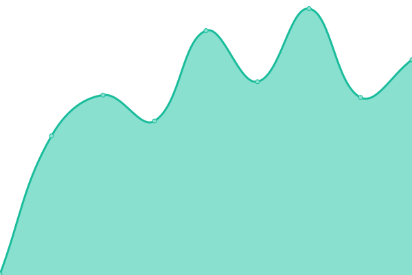
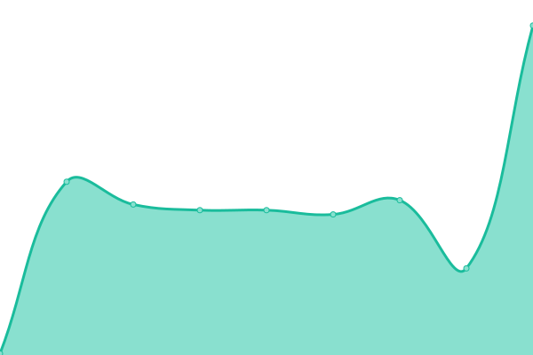
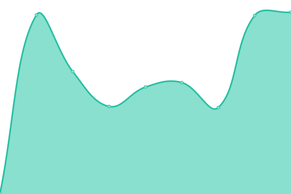
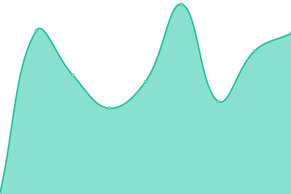

# [📈 Live Status](https://uptime.esolia.pro): <!--live status--> **🟧 Partial outage**

This repository contains the open-source uptime monitor and status page for [Rick Cogley](https://rick.cogley.info), powered by [Upptime](https://github.com/upptime/upptime).

With [Upptime](https://upptime.js.org), you can get your own unlimited and free uptime monitor and status page, powered entirely by a GitHub repository. We use [Issues](https://github.com/RickCogley/esolia-uptime/issues) as incident reports, [Actions](https://github.com/RickCogley/esolia-uptime/actions) as uptime monitors, and [Pages](https://uptime.esolia.pro) for the status page.

<!--start: status pages-->
<!-- This summary is generated by Upptime (https://github.com/upptime/upptime) -->
<!-- Do not edit this manually, your changes will be overwritten -->
<!-- prettier-ignore -->
| URL | Status | History | Response Time | Uptime |
| --- | ------ | ------- | ------------- | ------ |
|  [PROdb Cloud Database PaaS](https://pro.dbflex.net) | 🟩 Up | [pr-odb-cloud-database-paa-s.yml](https://github.com/RickCogley/esolia-uptime/commits/master/history/pr-odb-cloud-database-paa-s.yml) | 

 286ms
     
 | 

<a href="https://uptime.esolia.pro/history/pr-odb-cloud-database-paa-s">100.00%</a>
    

|  PROdb Cloud Database API Endpoint | 🟥 Down | [pr-odb-cloud-database-api-endpoint.yml](https://github.com/RickCogley/esolia-uptime/commits/master/history/pr-odb-cloud-database-api-endpoint.yml) | 

 36ms
     
 | 

<a href="https://uptime.esolia.pro/history/pr-odb-cloud-database-api-endpoint">10.02%</a>
    

|  [eSolia Newsletter System](https://send.esolia.pro) | 🟩 Up | [e-solia-newsletter-system.yml](https://github.com/RickCogley/esolia-uptime/commits/master/history/e-solia-newsletter-system.yml) | 

 207ms
     
 | 

<a href="https://uptime.esolia.pro/history/e-solia-newsletter-system">100.00%</a>
    

|  [eSolia Secret Sharing System](https://salty.esolia.pro) | 🟩 Up | [e-solia-secret-sharing-system.yml](https://github.com/RickCogley/esolia-uptime/commits/master/history/e-solia-secret-sharing-system.yml) | 

 85ms
     
 | 

<a href="https://uptime.esolia.pro/history/e-solia-secret-sharing-system">100.00%</a>
    

|  [eSolia.com English Site](https://esolia.com) | 🟩 Up | [e-solia-com-english-site.yml](https://github.com/RickCogley/esolia-uptime/commits/master/history/e-solia-com-english-site.yml) | 

 187ms
     
 | 

<a href="https://uptime.esolia.pro/history/e-solia-com-english-site">100.00%</a>
    

|  [eSolia.co.jp Japanese Site](https://esolia.co.jp) | 🟩 Up | [e-solia-co-jp-japanese-site.yml](https://github.com/RickCogley/esolia-uptime/commits/master/history/e-solia-co-jp-japanese-site.yml) | 

 218ms
     
 | 

<a href="https://uptime.esolia.pro/history/e-solia-co-jp-japanese-site">100.00%</a>
    

<!--end: status pages-->

[**Visit our status website →**](https://uptime.esolia.pro)

## 📄 License

- Powered by: [Upptime](https://github.com/upptime/upptime)
- Code: [MIT](./LICENSE) © [Rick Cogley](https://rick.cogley.info)
- Data in the `./history` directory: [Open Database License](https://opendatacommons.org/licenses/odbl/1-0/)
